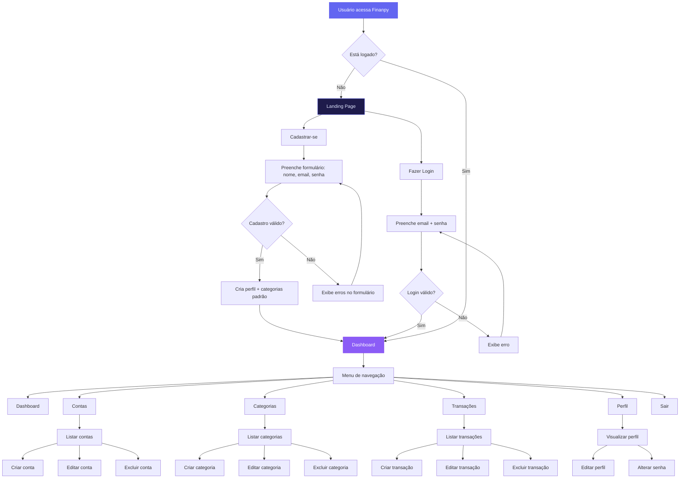
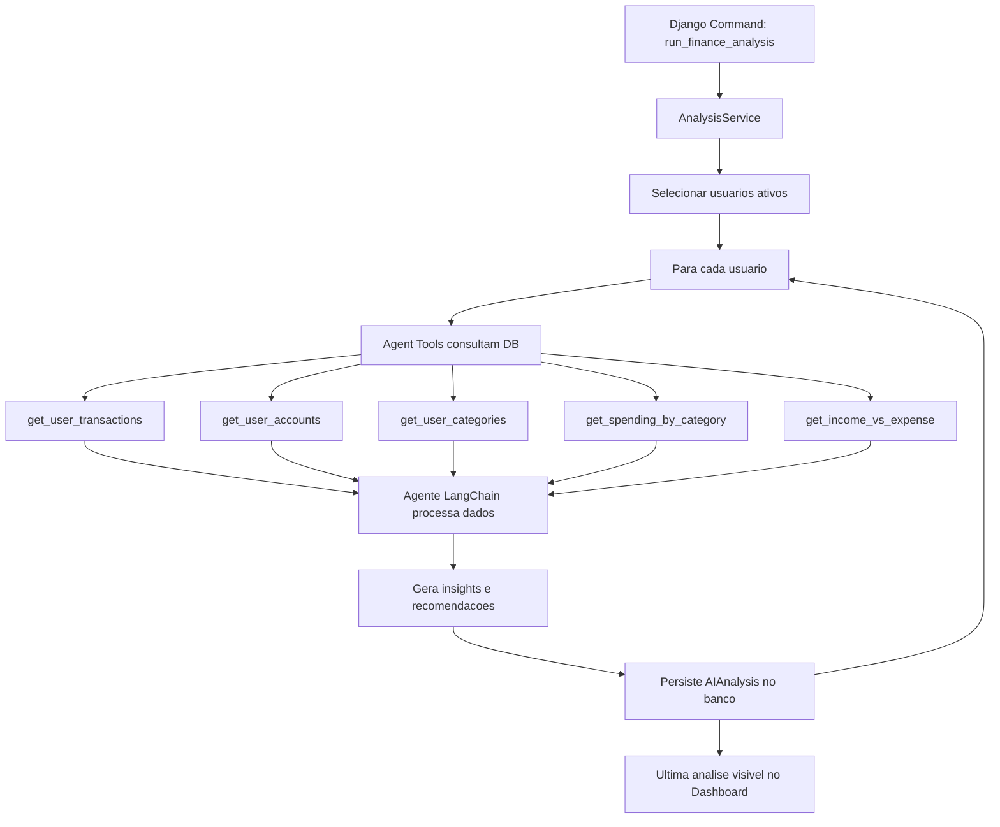

# finanpy - PRD (Product Requirement Document)

---

## 1. Visão geral

O **Finanpy** é um sistema web de gestão de finanças pessoais, construído com Django full stack, que permite ao usuário controlar suas receitas, despesas, contas bancárias e categorias de lançamentos de forma simples e intuitiva. O sistema utiliza Django Template Language com TailwindCSS para o frontend, seguindo um design system com tema escuro, gradientes modernos e identidade visual consistente em todas as telas.

---

## 2. Sobre o produto

O Finanpy é uma aplicação web monolítica, sem over engineering, que oferece:

- Site público de apresentação com opções de cadastro e login
- Autenticação via email (sem username)
- Dashboard principal com visão consolidada das finanças
- CRUD de contas bancárias
- CRUD de categorias de lançamentos
- CRUD de transações (entradas e saídas)
- Perfil de usuário editável

O projeto prioriza simplicidade, usando recursos nativos do Django (Class Based Views, auth, ORM) e banco de dados SQLite.

---

## 3. Propósito

Proporcionar uma ferramenta simples e eficaz para que pessoas físicas organizem suas finanças pessoais, acompanhando receitas, despesas e saldos de forma centralizada e visual, sem a complexidade de sistemas de gestão financeira empresarial.

---

## 4. Público alvo

- Pessoas físicas que desejam organizar suas finanças pessoais
- Usuários que buscam uma alternativa gratuita e simples a planilhas
- Público brasileiro (interface 100% em português brasileiro)
- Usuários de diferentes níveis de familiaridade com tecnologia

---

## 5. Objetivos

| # | Objetivo | Métrica de sucesso |
|---|----------|-------------------|
| 1 | Permitir cadastro e login via email | Usuários conseguem se cadastrar e logar sem erros |
| 2 | Registrar transações financeiras (entradas/saídas) | CRUD completo funcional |
| 3 | Categorizar transações | Usuário consegue filtrar por categoria |
| 4 | Gerenciar contas bancárias | CRUD de contas funcional |
| 5 | Visualizar dashboard consolidado | Dashboard renderiza dados reais do usuário |
| 6 | Manter identidade visual consistente | Todas as telas seguem o design system |

---

## 6. Requisitos funcionais

### RF-01: Autenticação

- Cadastro de usuário com nome, email e senha
- Login via email e senha
- Logout
- Recuperação de senha (reset via email - configurável)
- Redirecionamento automático para dashboard após login

### RF-02: Perfil de usuário

- Visualizar perfil (nome, email, data de cadastro)
- Editar nome e email
- Alterar senha

### RF-03: Contas bancárias

- Criar conta bancária (nome, tipo, saldo inicial, instituição, cor/ícone)
- Listar contas do usuário
- Editar conta bancária
- Excluir conta bancária (com confirmação)
- Visualizar saldo total consolidado

### RF-04: Categorias

- Criar categoria (nome, tipo: receita/despesa, cor/ícone)
- Listar categorias do usuário
- Editar categoria
- Excluir categoria (com confirmação)
- Categorias padrão criadas ao cadastrar usuário

### RF-05: Transações

- Criar transação (descrição, valor, tipo: entrada/saída, data, categoria, conta)
- Listar transações do usuário (com filtros e busca)
- Editar transação
- Excluir transação (com confirmação)
- Visualizar transações por período

### RF-06: Dashboard

- Exibir saldo total
- Exibir total de receitas do período
- Exibir total de despesas do período
- Listar transações recentes
- Gráfico simples de receitas vs despesas (por mês)
- Listagem de contas com saldos

### RF-07: Site público

- Landing page com apresentação do produto
- Seção de features/benefícios
- Botões de cadastro e login
- Página de cadastro
- Página de login

### Flowchart de UX (Mermaid)



---

## 7. Requisitos não-funcionais

| # | Requisito | Detalhamento |
|---|-----------|-------------|
| RNF-01 | Performance | Páginas devem carregar em até 2s em conexão normal |
| RNF-02 | Responsividade | Interface responsiva para desktop, tablet e mobile |
| RNF-03 | Segurança | Senhas hasheadas com bcrypt/argon2, CSRF protection nativa, HTTPS em produção |
| RNF-04 | Usabilidade | Interface em português brasileiro, mensagens de erro claras |
| RNF-05 | Manutenibilidade | Código em inglês, seguindo PEP8, aspas simples, apps Django separados por domínio |
| RNF-06 | Banco de dados | SQLite para desenvolvimento; migração para PostgreSQL em produção |
| RNF-07 | Compatibilidade | Suporte aos navegadores modernos (Chrome, Firefox, Safari, Edge) |
| RNF-08 | Simplicidade | Sem over engineering, sem APIs externas desnecessárias |
| RNF-09 | Auditoria | Campos `created_at` e `updated_at` em todos os models |
| RNF-10 | Escalabilidade | Dados isolados por usuário (cada usuário vê apenas seus dados) |

---

## 8. Arquitetura técnica

### 8.1 Stack

| Camada | Tecnologia |
|--------|-----------|
| Backend | Django 5.2+ |
| Frontend | Django Template Language + TailwindCSS |
| Banco de dados | SQLite (desenvolvimento) |
| Auth | Django Auth customizado (login por email) |
| Servidor | Django runserver (dev) / Gunicorn (produção) |
| CSS Framework | TailwindCSS via CDN ou django-tailwind |
| Ícones | Heroicons via CDN |
| Fontes | Inter (Google Fonts) |

### 8.2 Estrutura de dados (Schemas Mermaid)

```mermaid
erDiagram
    User {
        int id PK
        string email UK
        string password
        string first_name
        string last_name
        boolean is_active
        boolean is_staff
        datetime created_at
        datetime updated_at
    }

    Profile {
        int id PK
        int user_id FK
        string avatar
        datetime created_at
        datetime updated_at
    }

    Account {
        int id PK
        int user_id FK
        string name
        string account_type
        decimal balance
        string institution
        string color
        boolean is_active
        datetime created_at
        datetime updated_at
    }

    Category {
        int id PK
        int user_id FK
        string name
        string category_type
        string color
        string icon
        datetime created_at
        datetime updated_at
    }

    Transaction {
        int id PK
        int user_id FK
        int account_id FK
        int category_id FK
        string description
        decimal amount
        string transaction_type
        date date
        datetime created_at
        datetime updated_at
    }

    User ||--o|| Profile : has
    User ||--o{ Account : owns
    User ||--o{ Category : owns
    User ||--o{ Transaction : creates
    Account ||--o{ Transaction : has
    Category ||--o{ Transaction : belongs_to
```

### 8.3 Estrutura de diretórios do projeto

> **Nota:** Os apps `accounts`, `categories`, `transactions`, `profiles` e `users` já foram criados com `startapp` (arquivos padrão). Os arquivos como `forms.py`, `urls.py`, `signals.py` e os diretórios `templates/`, `static/` serão criados durante as sprints. O ambiente virtual `.venv` já existe.

```
finanpy/
├── accounts/                 # contas bancárias
│   ├── __init__.py
│   ├── admin.py
│   ├── apps.py
│   ├── forms.py
│   ├── migrations/
│   │   └── __init__.py
│   ├── models.py
│   ├── urls.py
│   └── views.py
├── categories/               # categorias de lançamentos
│   ├── __init__.py
│   ├── admin.py
│   ├── apps.py
│   ├── forms.py
│   ├── migrations/
│   │   └── __init__.py
│   ├── models.py
│   ├── urls.py
│   └── views.py
├── core/                     # configurações globais
│   ├── __init__.py
│   ├── asgi.py
│   ├── settings.py
│   ├── urls.py
│   └── wsgi.py
├── profiles/                 # perfis de usuários
│   ├── __init__.py
│   ├── admin.py
│   ├── apps.py
│   ├── forms.py
│   ├── migrations/
│   │   └── __init__.py
│   ├── models.py
│   ├── urls.py
│   └── views.py
├── static/                   # arquivos estáticos
│   ├── css/
│   ├── js/
│   └── img/
├── templates/                 # templates globais
│   ├── base.html
│   ├── components/
│   │   ├── navbar.html
│   │   ├── sidebar.html
│   │   ├── card.html
│   │   ├── table.html
│   │   ├── pagination.html
│   │   ├── form.html
│   │   ├── alert.html
│   │   └── modal.html
│   ├── pages/
│   │   ├── landing.html
│   │   ├── login.html
│   │   └── register.html
│   └── partials/
│       └── messages.html
├── transactions/              # transações
│   ├── __init__.py
│   ├── admin.py
│   ├── apps.py
│   ├── forms.py
│   ├── migrations/
│   │   └── __init__.py
│   ├── models.py
│   ├── urls.py
│   └── views.py
├── users/                    # usuários
│   ├── __init__.py
│   ├── admin.py
│   ├── apps.py
│   ├── forms.py
│   ├── migrations/
│   │   └── __init__.py
│   ├── models.py
│   ├── signals.py
│   ├── urls.py
│   └── views.py
├── db.sqlite3
├── manage.py
└── requirements.txt
```

---

## 9. Design system

### 9.1 Paleta de cores

O Finanpy usa tema escuro com acentos em violet/indigo. Todos os estilos usam TailwindCSS dentro do Django Template Language.

| Função | Cor | Tailwind Class |
|--------|-----|----------------|
| Fundo principal | `#0f0d1a` | `bg-[#0f0d1a]` |
| Fundo de cards/superfícies | `#1a1730` | `bg-[#1a1730]` |
| Fundo de inputs/áreas elevadas | `#241f3c` | `bg-[#241f3c]` |
| Borda sutil | `#2d2754` | `border-[#2d2754]` |
| Texto primário | `#f0eef5` | `text-[#f0eef5]` |
| Texto secundário | `#a09cb5` | `text-[#a09cb5]` |
| Texto terciário/muted | `#6b6785` | `text-[#6b6785]` |
| Accent primário (violet) | `#7c3aed` | `bg-violet-600` |
| Accent hover | `#6d28d9` | `bg-violet-700` |
| Accent gradient start | `#6366f1` | `from-indigo-500` |
| Accent gradient end | `#a855f7` | `to-purple-500` |
| Sucesso/Receita | `#22c55e` | `text-green-500` |
| Erro/Despesa | `#ef4444` | `text-red-500` |
| Aviso | `#f59e0b` | `text-amber-500` |
| Info | `#3b82f6` | `text-blue-500` |

### 9.2 Gradientes

| Uso | Gradiente | Tailwind Classes |
|-----|-----------|-----------------|
| Botões primários | Indigo → Purple | `bg-gradient-to-r from-indigo-500 to-purple-500` |
| Card destaque | Indigo → Violet | `bg-gradient-to-br from-indigo-600 to-violet-700` |
| Hero/Landing | Indigo → Purple → Fuchsia | `bg-gradient-to-r from-indigo-600 via-purple-600 to-fuchsia-500` |
| Sidebar ativo | Indigo → Violet | `bg-gradient-to-r from-indigo-600/20 to-violet-600/20` |

### 9.3 Tipografia

| Elemento | Fonte | Tailwind Classes |
|----------|-------|-----------------|
| Heading H1 | Inter Bold 2.5rem | `text-4xl font-bold` |
| Heading H2 | Inter Bold 2rem | `text-3xl font-bold` |
| Heading H3 | Inter Semibold 1.5rem | `text-2xl font-semibold` |
| Body | Inter Regular 1rem | `text-base` |
| Small | Inter Regular 0.875rem | `text-sm` |
| Label | Inter Medium 0.875rem | `text-sm font-medium` |

Fonte carregada via Google Fonts: `<link href="https://fonts.googleapis.com/css2?family=Inter:wght@400;500;600;700&display=swap" rel="stylesheet">`

### 9.4 Componentes

#### 9.4.1 Botões

```html
{# Botão primário #}
<button class='px-4 py-2 rounded-lg bg-gradient-to-r from-indigo-500 to-purple-500
  text-white font-medium hover:from-indigo-600 hover:to-purple-600
  transition-all duration-200 shadow-lg shadow-violet-500/25'>
  Ação
</button>

{# Botão secundário #}
<button class='px-4 py-2 rounded-lg border border-[#2d2754] text-[#a09cb5]
  hover:bg-[#241f3c] transition-all duration-200'>
  Cancelar
</button>

{# Botão de perigo #}
<button class='px-4 py-2 rounded-lg bg-red-500/10 text-red-400 border border-red-500/20
  hover:bg-red-500/20 transition-all duration-200'>
  Excluir
</button>
```

#### 9.4.2 Inputs / Forms

```html
<div class='space-y-1'>
  <label class='block text-sm font-medium text-[#a09cb5]'>Campo</label>
  <input type='text'
    class='w-full px-4 py-2.5 rounded-lg bg-[#0f0d1a] border border-[#2d2754]
    text-[#f0eef5] placeholder-[#6b6785] focus:outline-none focus:border-violet-500
    focus:ring-1 focus:ring-violet-500 transition-all duration-200' />
</div>
```

#### 9.4.3 Cards

```html
<div class='rounded-xl bg-[#1a1730] border border-[#2d2754] p-6
  shadow-lg shadow-black/20'>
  {# conteúdo #}
</div>

{# Card com gradiente #}
<div class='rounded-xl bg-gradient-to-br from-indigo-600 to-violet-700 p-6
  shadow-lg shadow-violet-500/20'>
  {# conteúdo #}
</div>
```

#### 9.4.4 Tabelas

```html
<div class='rounded-xl bg-[#1a1730] border border-[#2d2754] overflow-hidden'>
  <table class='w-full'>
    <thead>
      <tr class='border-b border-[#2d2754]'>
        <th class='px-4 py-3 text-left text-sm font-medium text-[#a09cb5]'>Coluna</th>
      </tr>
    </thead>
    <tbody>
      <tr class='border-b border-[#2d2754]/50 hover:bg-[#241f3c]/50 transition-colors'>
        <td class='px-4 py-3 text-sm text-[#f0eef5]'>Valor</td>
      </tr>
    </tbody>
  </table>
</div>
```

#### 9.4.5 Sidebar/Menu

```html
<nav class='w-64 min-h-screen bg-[#0f0d1a] border-r border-[#2d2754]'>
  <div class='p-6'>
    <a href='#' class='logo text-xl font-bold bg-gradient-to-r from-indigo-500 to-purple-500
      bg-clip-text text-transparent'>Finanpy</a>
  </div>
  <ul class='space-y-1 px-3'>
    <li>
      <a href='#'
        class='flex items-center gap-3 px-4 py-2.5 rounded-lg bg-gradient-to-r
        from-indigo-600/20 to-violet-600/20 text-violet-400 font-medium'>
        <span>Dashboard</span>
      </a>
    </li>
    <li>
      <a href='#'
        class='flex items-center gap-3 px-4 py-2.5 rounded-lg text-[#a09cb5]
        hover:bg-[#1a1730] transition-all duration-200'>
        <span>Contas</span>
      </a>
    </li>
  </ul>
</nav>
```

#### 9.4.6 Alerts / Mensagens

```html
{# Sucesso #}
<div class='rounded-lg bg-green-500/10 border border-green-500/20 px-4 py-3
  text-green-400 text-sm'>
  Operação realizada com sucesso.
</div>

{# Erro #}
<div class='rounded-lg bg-red-500/10 border border-red-500/20 px-4 py-3
  text-red-400 text-sm'>
  Ocorreu um erro.
</div>
```

#### 9.4.7 Modal

```html
<div class='fixed inset-0 z-50 flex items-center justify-center bg-black/60 backdrop-blur-sm'>
  <div class='w-full max-w-md rounded-xl bg-[#1a1730] border border-[#2d2754] p-6
    shadow-2xl'>
    <h3 class='text-lg font-semibold text-[#f0eef5]'>Confirmar ação</h3>
    <p class='mt-2 text-sm text-[#a09cb5]'>Tem certeza?</p>
    <div class='mt-6 flex justify-end gap-3'>
      <button class='px-4 py-2 rounded-lg border border-[#2d2754] text-[#a09cb5]'>Cancelar</button>
      <button class='px-4 py-2 rounded-lg bg-gradient-to-r from-indigo-500 to-purple-500
        text-white'>Confirmar</button>
    </div>
  </div>
</div>
```

#### 9.4.8 Grid / Layout

```html
{# Layout principal: sidebar + conteúdo #}
<div class='flex min-h-screen bg-[#0f0d1a]'>
  
  <main class='flex-1 p-6'>
    {# conteúdo #}
  </main>
</div>

{# Grid de cards no dashboard #}
<div class='grid grid-cols-1 md:grid-cols-2 lg:grid-cols-4 gap-4'>
  {# cards de métricas #}
</div>
```

### 9.5 Padrões visuais gerais

- **Border radius**: `rounded-lg` para inputs/botões, `rounded-xl` para cards/modais
- **Shadows**: `shadow-lg shadow-black/20` para cards, `shadow-lg shadow-violet-500/25` para botões gradient
- **Transições**: `transition-all duration-200` em todos elementos interativos
- **Espaçamento**: `p-6` para cards, `gap-4` para grids, `space-y-6` para seções
- **Foco**: `focus:border-violet-500 focus:ring-1 focus:ring-violet-500` para inputs
- **Hover**: sempre com `transition-all duration-200`

---

## 10. User stories

### Épico 1: Autenticação e Acesso

**US-01**: Como visitante, quero me cadastrar com nome, email e senha para acessar o sistema.
- Critérios de aceite:
  - [ ] Formulário com campos nome, email, senha e confirmação de senha
  - [ ] Validação de email único
  - [ ] Validação de força da senha (mínimo 8 caracteres)
  - [ ] Criação automática de perfil após cadastro
  - [ ] Criação de categorias padrão após cadastro
  - [ ] Redirecionamento para dashboard após cadastro

**US-02**: Como usuário, quero fazer login com email e senha para acessar minha conta.
- Critérios de aceite:
  - [ ] Formulário com campos email e senha
  - [ ] Login via email (não username)
  - [ ] Mensagem de erro clara para credenciais inválidas
  - [ ] Redirecionamento para dashboard após login
  - [ ] Opção "Lembrar-me"

**US-03**: Como usuário, quero fazer logout para encerrar minha sessão.
- Critérios de aceite:
  - [ ] Botão de logout no menu/sidebar
  - [ ] Redirecionamento para landing page após logout

### Épico 2: Dashboard

**US-04**: Como usuário, quero ver um dashboard com resumo das minhas finanças.
- Critérios de aceite:
  - [ ] Card com saldo total (soma dos saldos de todas as contas)
  - [ ] Card com total de receitas do mês atual
  - [ ] Card com total de despesas do mês atual
  - [ ] Card com saldo do mês (receitas - despesas)
  - [ ] Lista das 5 transações mais recentes
  - [ ] Cards de contas com respectivos saldos

### Épico 3: Contas Bancárias

**US-05**: Como usuário, quero criar contas bancárias para organizar meu dinheiro.
- Critérios de aceite:
  - [ ] Formulário com nome, tipo (corrente, poupança, carteira, investimento), instituição, saldo inicial, cor
  - [ ] Conta aparece na listagem após criação
  - [ ] Validação de campos obrigatórios

**US-06**: Como usuário, quero listar minhas contas bancárias.
- Critérios de aceite:
  - [ ] Listagem em cards ou tabela com nome, tipo, saldo e instituição
  - [ ] Indicação visual de contas ativas/inativas
  - [ ] Ações de editar e excluir em cada conta

**US-07**: Como usuário, quero editar uma conta bancária.
- Critérios de aceite:
  - [ ] Formulário preenchido com dados atuais
  - [ ] Atualização reflete na listagem

**US-08**: Como usuário, quero excluir uma conta bancária.
- Critérios de aceite:
  - [ ] Confirmação via modal antes de excluir
  - [ ] Conta removida da listagem

### Épico 4: Categorias

**US-09**: Como usuário, quero criar categorias para classificar minhas transações.
- Critérios de aceite:
  - [ ] Formulário com nome, tipo (receita/despesa), cor
  - [ ] Categoria aparece na listagem após criação

**US-10**: Como usuário, quero ver minhas categorias organizadas por tipo.
- Critérios de aceite:
  - [ ] Abas ou filtros para receitas e despesas
  - [ ] Indicação visual de cor e tipo

**US-11**: Como usuário, quero editar uma categoria.
- Critérios de aceite:
  - [ ] Formulário preenchido com dados atuais
  - [ ] Atualização reflete na listagem

**US-12**: Como usuário, quero excluir uma categoria.
- Critérios de aceite:
  - [ ] Confirmação via modal
  - [ ] Aviso se existem transações associadas

### Épico 5: Transações

**US-13**: Como usuário, quero registrar uma transação (entrada ou saída).
- Critérios de aceite:
  - [ ] Formulário com descrição, valor, tipo (entrada/saída), data, categoria, conta
  - [ ] Apenas categorias do tipo correspondente são exibidas
  - [ ] O saldo da conta é atualizado ao registrar
  - [ ] Validação de campos obrigatórios e valor positivo

**US-14**: Como usuário, quero listar minhas transações com filtros.
- Critérios de aceite:
  - [ ] Filtros por período, tipo, categoria e conta
  - [ ] Busca por descrição
  - [ ] Paginação
  - [ ] Indicação visual de entrada (verde) e saída (vermelho)

**US-15**: Como usuário, quero editar uma transação.
- Critérios de aceite:
  - [ ] Formulário preenchido com dados atuais
  - [ ] Saldo da conta é ajustado ao editar

**US-16**: Como usuário, quero excluir uma transação.
- Critérios de aceite:
  - [ ] Confirmação via modal
  - [ ] Saldo da conta é ajustado ao excluir

### Épico 6: Perfil

**US-17**: Como usuário, quero visualizar e editar meu perfil.
- Critérios de aceite:
  - [ ] Exibir nome, email e data de cadastro
  - [ ] Edição de nome e email
  - [ ] Alteração de senha separada

---

## 11. Métricas de sucesso

### KPIs de Produto

| KPI | Descrição | Meta |
|-----|-----------|------|
| Taxa de cadastro | % de visitantes que se cadastram | > 10% |
| Retenção semanal | % de usuários que retornam semanalmente | > 40% |
| Transações por usuário | Média de transações criadas por usuário ativo | > 5/mês |

### KPIs de Usuário

| KPI | Descrição | Meta |
|-----|-----------|------|
| Tempo médio de sessão | Duração média de uma sessão | > 3 minutos |
| Satisfação | Feedback positivo dos usuários | > 80% |
| Completude do perfil | % de usuários com dados completos | > 60% |

### KPIs Técnicos

| KPI | Descrição | Meta |
|-----|-----------|------|
| Uptime | Disponibilidade do sistema | > 99% |
| Tempo de resposta | Média de carregamento das páginas | < 2s |
| Erros | Taxa de erros 500 | < 0.1% |

---

## 12. Riscos e mitigações

| # | Risco | Probabilidade | Impacto | Mitigação |
|---|-------|--------------|---------|-----------|
| 1 | Escopo crescente além do previsto | Média | Alto | Priorizar MVP, adicionar features gradualmente |
| 2 | Complexidade desnecessária no código | Média | Médio | Seguir princípios de simplicidade, revisar código |
| 3 | Performance com volume de transações | Baixa | Médio | Otimizar queries, usar select_related/prefetch_related |
| 4 | Falta de testes automatizados inicialmente | Alta | Médio | Implementar testes em sprint dedicada |
| 5 | Segurança de dados do usuário | Média | Alto | Usar auth nativo, CSRF, HTTPS em produção |
| 6 | Dificuldade com deploy | Baixa | Médio | Planejar sprint de infra/Docker no final |
| 7 | Manutenção do design system | Baixa | Médio | Documentar componentes, usar templates base do Django |

---

## 13. Agente de IA Financeiro

### 13.1 Visão geral

O Finanpy contará com um **Agente de IA Financeiro** capaz de analisar os dados financeiros do usuário (transações, receitas, despesas e categorias) e gerar **insights e dicas personalizadas**. Cada análise é individual por usuário e persistida no banco de dados, permitindo histórico e comparação ao longo do tempo.

### 13.2 Objetivo

Proporcionar ao usuário uma camada de inteligência sobre seus dados financeiros, oferecendo recomendações proativas, identificação de padrões de gastos e sugestões de economia — sem necessidade de análise manual.

### 13.3 Fluxo de funcionamento



1. O comando `python manage.py run_finance_analysis` é executado manualmente
2. O `AnalysisService` itera sobre todos os usuários ativos
3. Para cada usuário, o agente LangChain utiliza **tools** para consultar transações, contas e categorias
4. O agente processa os dados e gera uma análise textual com insights e dicas
5. A análise é salva no model `AIAnalysis`, vinculada ao usuário
6. A análise mais recente de cada usuário é exibida no dashboard

### 13.4 Modelo de dados — AIAnalysis

| Campo | Tipo | Detalhes |
|-------|------|---------|
| id | BigAutoField | PK |
| user | ForeignKey(User) | on_delete=CASCADE, related_name='ai_analyses' |
| analysis_text | TextField | conteúdo completo da análise gerada pela IA |
| key_insights | JSONField | default=list, principais insights extraídos |
| recommendations | JSONField | default=list, recomendações geradas |
| period_analyzed | CharField | max_length=100, período analisado (ex: "Últimos 30 dias") |
| model_used | CharField | max_length=50, modelo LLM utilizado (valor de settings.OPENAI_MODEL) |
| tokens_input | IntegerField | default=0, tokens de entrada consumidos |
| tokens_output | IntegerField | default=0, tokens de saída consumidos |
| is_latest | BooleanField | default=True, marca a análise mais recente do usuário |
| created_at | DateTimeField | auto_now_add |
| updated_at | DateTimeField | auto_now |

- `Meta.ordering = ['-created_at']`
- `Meta.verbose_name = 'análise IA'`, `Meta.verbose_name_plural = 'análises IA'`
- Indexes em `(user, -created_at)` e `(user, is_latest)`
- Ao criar uma nova análise para o usuário, `is_latest=True` da análise anterior é setado para `False`
- Rate limiting: não gerar nova análise se a última for há menos de 24h (configurável)

### 13.5 Estrutura da app `ai`

```
ai/
├── __init__.py
├── agents/
│   ├── __init__.py
│   └── finance_insight_agent.py      # agente LangChain que gera análises financeiras
├── management/
│   └── commands/
│       └── run_finance_analysis.py    # Django Command para executar a análise
├── migrations/
│   └── __init__.py
├── models.py                         # modelo AIAnalysis
├── services/
│   ├── __init__.py
│   └── analysis_service.py           # orquestra análise e integração com o agente
├── tools/
│   ├── __init__.py
│   └── database_tools.py             # LangChain tools para consultar dados do banco
├── admin.py
├── apps.py
└── views.py                          # AIAnalysisDetailView
```

### 13.6 Tecnologias e dependências

| Tecnologia | Versão | Uso |
|------------|--------|-----|
| LangChain | 1.0+ | Framework para orquestração do agente de IA |
| OpenAI API | — | Provedor do modelo LLM |
| GPT-5-mini | — | Modelo LLM padrão (configurável via `OPENAI_MODEL` no `.env`) |
| python-dotenv | — | Gerenciamento de variáveis de ambiente |

> **Configuração de ambiente:** As variáveis `OPENAI_API_KEY`, `OPENAI_MODEL`, `AI_MAX_TOKENS` e `AI_TEMPERATURE` ficam no arquivo `.env` (nunca commitado). O `settings.py` lê com `os.getenv()` e define valores padrão. O `.env.example` serve como referência sem chaves reais.

### 13.7 Execução via Django Command

```bash
# Ativar venv
.venv\Scripts\activate

# Executar análise financeira para todos os usuários
python manage.py run_finance_analysis

# Executar análise para um usuário específico
python manage.py run_finance_analysis --user-id 1
```

O comando:
- Seleciona usuários ativos (ou um usuário específico via `--user-id`)
- Para cada usuário, chama o `AnalysisService`
- O `AnalysisService` instancia o agente LangChain com as tools de banco de dados
- O agente consulta transações, contas e categorias do usuário
- O agente gera a análise e retorna o conteúdo
- O `AnalysisService` persiste o resultado no model `AIAnalysis`

### 13.8 Integração com o Dashboard

A análise mais recente (marcada com `is_latest=True`) será exibida no dashboard do usuário como um card com o resumo e um link para ver a análise completa.

### 13.9 Riscos e mitigações

| # | Risco | Mitigação |
|---|-------|-----------|
| 1 | Custo da API OpenAI | Limitar execuções manuais, usar modelo econômico (configurável via `OPENAI_MODEL`), monitorar tokens |
| 2 | Análise genérica / pouco útil | Prompt engineering robusto, dados contextuais do usuário no prompt |
| 3 | Dependência de serviço externo | Tratar falhas de API gracefully, permitir reexecução |
| 4 | Performance do comando | Execução síncrona e manual (sem agendamento nesta fase) |
| 5 | Vazamento de chave API | Chave e modelo ficam no `.env` (nunca commitado), `.env.example` como referência |

---

## 14. Lista de tarefas

### Lista de tarefas está no diretório corrente, no arquivo [TASKS.md](TASKS.md)