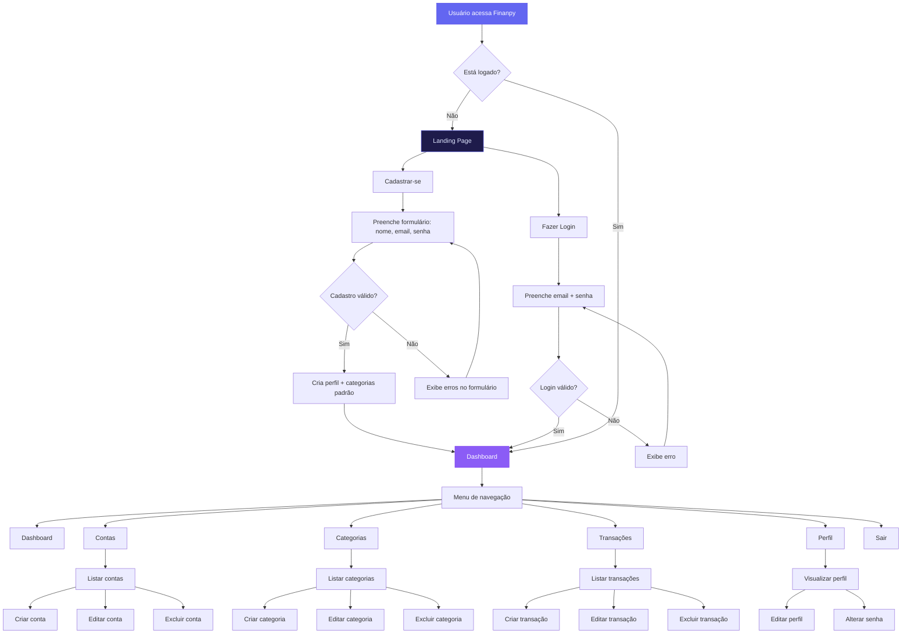

# finanpy - PRD (Product Requirement Document)

---

## 1. Visão geral

O **Finanpy** é um sistema web de gestão de finanças pessoais, construído com Django full stack, que permite ao usuário controlar suas receitas, despesas, contas bancárias e categorias de lançamentos de forma simples e intuitiva. O sistema utiliza Django Template Language com TailwindCSS para o frontend, seguindo um design system com tema escuro, gradientes modernos e identidade visual consistente em todas as telas.

---

## 2. Sobre o produto

O Finanpy é uma aplicação web monolítica, sem over engineering, que oferece:

- Site público de apresentação com opções de cadastro e login
- Autenticação via email (sem username)
- Dashboard principal com visão consolidada das finanças
- CRUD de contas bancárias
- CRUD de categorias de lançamentos
- CRUD de transações (entradas e saídas)
- Perfil de usuário editável

O projeto prioriza simplicidade, usando recursos nativos do Django (Class Based Views, auth, ORM) e banco de dados SQLite.

---

## 3. Propósito

Proporcionar uma ferramenta simples e eficaz para que pessoas físicas organizem suas finanças pessoais, acompanhando receitas, despesas e saldos de forma centralizada e visual, sem a complexidade de sistemas de gestão financeira empresarial.

---

## 4. Público alvo

- Pessoas físicas que desejam organizar suas finanças pessoais
- Usuários que buscam uma alternativa gratuita e simples a planilhas
- Público brasileiro (interface 100% em português brasileiro)
- Usuários de diferentes níveis de familiaridade com tecnologia

---

## 5. Objetivos

| # | Objetivo | Métrica de sucesso |
|---|----------|-------------------|
| 1 | Permitir cadastro e login via email | Usuários conseguem se cadastrar e logar sem erros |
| 2 | Registrar transações financeiras (entradas/saídas) | CRUD completo funcional |
| 3 | Categorizar transações | Usuário consegue filtrar por categoria |
| 4 | Gerenciar contas bancárias | CRUD de contas funcional |
| 5 | Visualizar dashboard consolidado | Dashboard renderiza dados reais do usuário |
| 6 | Manter identidade visual consistente | Todas as telas seguem o design system |

---

## 6. Requisitos funcionais

### RF-01: Autenticação

- Cadastro de usuário com nome, email e senha
- Login via email e senha
- Logout
- Recuperação de senha (reset via email - configurável)
- Redirecionamento automático para dashboard após login

### RF-02: Perfil de usuário

- Visualizar perfil (nome, email, data de cadastro)
- Editar nome e email
- Alterar senha

### RF-03: Contas bancárias

- Criar conta bancária (nome, tipo, saldo inicial, instituição, cor/ícone)
- Listar contas do usuário
- Editar conta bancária
- Excluir conta bancária (com confirmação)
- Visualizar saldo total consolidado

### RF-04: Categorias

- Criar categoria (nome, tipo: receita/despesa, cor/ícone)
- Listar categorias do usuário
- Editar categoria
- Excluir categoria (com confirmação)
- Categorias padrão criadas ao cadastrar usuário

### RF-05: Transações

- Criar transação (descrição, valor, tipo: entrada/saída, data, categoria, conta)
- Listar transações do usuário (com filtros e busca)
- Editar transação
- Excluir transação (com confirmação)
- Visualizar transações por período

### RF-06: Dashboard

- Exibir saldo total
- Exibir total de receitas do período
- Exibir total de despesas do período
- Listar transações recentes
- Gráfico simples de receitas vs despesas (por mês)
- Listagem de contas com saldos

### RF-07: Site público

- Landing page com apresentação do produto
- Seção de features/benefícios
- Botões de cadastro e login
- Página de cadastro
- Página de login

### Flowchart de UX (Mermaid)



---

## 7. Requisitos não-funcionais

| # | Requisito | Detalhamento |
|---|-----------|-------------|
| RNF-01 | Performance | Páginas devem carregar em até 2s em conexão normal |
| RNF-02 | Responsividade | Interface responsiva para desktop, tablet e mobile |
| RNF-03 | Segurança | Senhas hasheadas com bcrypt/argon2, CSRF protection nativa, HTTPS em produção |
| RNF-04 | Usabilidade | Interface em português brasileiro, mensagens de erro claras |
| RNF-05 | Manutenibilidade | Código em inglês, seguindo PEP8, aspas simples, apps Django separados por domínio |
| RNF-06 | Banco de dados | SQLite para desenvolvimento; migração para PostgreSQL em produção |
| RNF-07 | Compatibilidade | Suporte aos navegadores modernos (Chrome, Firefox, Safari, Edge) |
| RNF-08 | Simplicidade | Sem over engineering, sem APIs externas desnecessárias |
| RNF-09 | Auditoria | Campos `created_at` e `updated_at` em todos os models |
| RNF-10 | Escalabilidade | Dados isolados por usuário (cada usuário vê apenas seus dados) |

---

## 8. Arquitetura técnica

### 8.1 Stack

| Camada | Tecnologia |
|--------|-----------|
| Backend | Django 5.2+ |
| Frontend | Django Template Language + TailwindCSS |
| Banco de dados | SQLite (desenvolvimento) |
| Auth | Django Auth customizado (login por email) |
| Servidor | Django runserver (dev) / Gunicorn (produção) |
| CSS Framework | TailwindCSS via CDN ou django-tailwind |
| Ícones | Heroicons via CDN |
| Fontes | Inter (Google Fonts) |

### 8.2 Estrutura de dados (Schemas Mermaid)

```mermaid
erDiagram
    User {
        int id PK
        string email UK
        string password
        string first_name
        string last_name
        boolean is_active
        boolean is_staff
        datetime created_at
        datetime updated_at
    }

    Profile {
        int id PK
        int user_id FK
        string avatar
        datetime created_at
        datetime updated_at
    }

    Account {
        int id PK
        int user_id FK
        string name
        string account_type
        decimal balance
        string institution
        string color
        boolean is_active
        datetime created_at
        datetime updated_at
    }

    Category {
        int id PK
        int user_id FK
        string name
        string category_type
        string color
        string icon
        datetime created_at
        datetime updated_at
    }

    Transaction {
        int id PK
        int user_id FK
        int account_id FK
        int category_id FK
        string description
        decimal amount
        string transaction_type
        date date
        datetime created_at
        datetime updated_at
    }

    User ||--o|| Profile : has
    User ||--o{ Account : owns
    User ||--o{ Category : owns
    User ||--o{ Transaction : creates
    Account ||--o{ Transaction : has
    Category ||--o{ Transaction : belongs_to
```

### 8.3 Estrutura de diretórios do projeto

> **Nota:** Os apps `accounts`, `categories`, `transactions`, `profiles` e `users` já foram criados com `startapp` (arquivos padrão). Os arquivos como `forms.py`, `urls.py`, `signals.py` e os diretórios `templates/`, `static/` serão criados durante as sprints. O ambiente virtual `.venv` já existe.

```
finanpy/
├── accounts/                 # contas bancárias
│   ├── __init__.py
│   ├── admin.py
│   ├── apps.py
│   ├── forms.py
│   ├── migrations/
│   │   └── __init__.py
│   ├── models.py
│   ├── urls.py
│   └── views.py
├── categories/               # categorias de lançamentos
│   ├── __init__.py
│   ├── admin.py
│   ├── apps.py
│   ├── forms.py
│   ├── migrations/
│   │   └── __init__.py
│   ├── models.py
│   ├── urls.py
│   └── views.py
├── core/                     # configurações globais
│   ├── __init__.py
│   ├── asgi.py
│   ├── settings.py
│   ├── urls.py
│   └── wsgi.py
├── profiles/                 # perfis de usuários
│   ├── __init__.py
│   ├── admin.py
│   ├── apps.py
│   ├── forms.py
│   ├── migrations/
│   │   └── __init__.py
│   ├── models.py
│   ├── urls.py
│   └── views.py
├── static/                   # arquivos estáticos
│   ├── css/
│   ├── js/
│   └── img/
├── templates/                 # templates globais
│   ├── base.html
│   ├── components/
│   │   ├── navbar.html
│   │   ├── sidebar.html
│   │   ├── card.html
│   │   ├── table.html
│   │   ├── pagination.html
│   │   ├── form.html
│   │   ├── alert.html
│   │   └── modal.html
│   ├── pages/
│   │   ├── landing.html
│   │   ├── login.html
│   │   └── register.html
│   └── partials/
│       └── messages.html
├── transactions/              # transações
│   ├── __init__.py
│   ├── admin.py
│   ├── apps.py
│   ├── forms.py
│   ├── migrations/
│   │   └── __init__.py
│   ├── models.py
│   ├── urls.py
│   └── views.py
├── users/                    # usuários
│   ├── __init__.py
│   ├── admin.py
│   ├── apps.py
│   ├── forms.py
│   ├── migrations/
│   │   └── __init__.py
│   ├── models.py
│   ├── signals.py
│   ├── urls.py
│   └── views.py
├── db.sqlite3
├── manage.py
└── requirements.txt
```

---

## 9. Design system

### 9.1 Paleta de cores

O Finanpy usa tema escuro com acentos em violet/indigo. Todos os estilos usam TailwindCSS dentro do Django Template Language.

| Função | Cor | Tailwind Class |
|--------|-----|----------------|
| Fundo principal | `#0f0d1a` | `bg-[#0f0d1a]` |
| Fundo de cards/superfícies | `#1a1730` | `bg-[#1a1730]` |
| Fundo de inputs/áreas elevadas | `#241f3c` | `bg-[#241f3c]` |
| Borda sutil | `#2d2754` | `border-[#2d2754]` |
| Texto primário | `#f0eef5` | `text-[#f0eef5]` |
| Texto secundário | `#a09cb5` | `text-[#a09cb5]` |
| Texto terciário/muted | `#6b6785` | `text-[#6b6785]` |
| Accent primário (violet) | `#7c3aed` | `bg-violet-600` |
| Accent hover | `#6d28d9` | `bg-violet-700` |
| Accent gradient start | `#6366f1` | `from-indigo-500` |
| Accent gradient end | `#a855f7` | `to-purple-500` |
| Sucesso/Receita | `#22c55e` | `text-green-500` |
| Erro/Despesa | `#ef4444` | `text-red-500` |
| Aviso | `#f59e0b` | `text-amber-500` |
| Info | `#3b82f6` | `text-blue-500` |

### 9.2 Gradientes

| Uso | Gradiente | Tailwind Classes |
|-----|-----------|-----------------|
| Botões primários | Indigo → Purple | `bg-gradient-to-r from-indigo-500 to-purple-500` |
| Card destaque | Indigo → Violet | `bg-gradient-to-br from-indigo-600 to-violet-700` |
| Hero/Landing | Indigo → Purple → Fuchsia | `bg-gradient-to-r from-indigo-600 via-purple-600 to-fuchsia-500` |
| Sidebar ativo | Indigo → Violet | `bg-gradient-to-r from-indigo-600/20 to-violet-600/20` |

### 9.3 Tipografia

| Elemento | Fonte | Tailwind Classes |
|----------|-------|-----------------|
| Heading H1 | Inter Bold 2.5rem | `text-4xl font-bold` |
| Heading H2 | Inter Bold 2rem | `text-3xl font-bold` |
| Heading H3 | Inter Semibold 1.5rem | `text-2xl font-semibold` |
| Body | Inter Regular 1rem | `text-base` |
| Small | Inter Regular 0.875rem | `text-sm` |
| Label | Inter Medium 0.875rem | `text-sm font-medium` |

Fonte carregada via Google Fonts: `<link href="https://fonts.googleapis.com/css2?family=Inter:wght@400;500;600;700&display=swap" rel="stylesheet">`

### 9.4 Componentes

#### 9.4.1 Botões

```html
{# Botão primário #}
<button class='px-4 py-2 rounded-lg bg-gradient-to-r from-indigo-500 to-purple-500
  text-white font-medium hover:from-indigo-600 hover:to-purple-600
  transition-all duration-200 shadow-lg shadow-violet-500/25'>
  Ação
</button>

{# Botão secundário #}
<button class='px-4 py-2 rounded-lg border border-[#2d2754] text-[#a09cb5]
  hover:bg-[#241f3c] transition-all duration-200'>
  Cancelar
</button>

{# Botão de perigo #}
<button class='px-4 py-2 rounded-lg bg-red-500/10 text-red-400 border border-red-500/20
  hover:bg-red-500/20 transition-all duration-200'>
  Excluir
</button>
```

#### 9.4.2 Inputs / Forms

```html
<div class='space-y-1'>
  <label class='block text-sm font-medium text-[#a09cb5]'>Campo</label>
  <input type='text'
    class='w-full px-4 py-2.5 rounded-lg bg-[#0f0d1a] border border-[#2d2754]
    text-[#f0eef5] placeholder-[#6b6785] focus:outline-none focus:border-violet-500
    focus:ring-1 focus:ring-violet-500 transition-all duration-200' />
</div>
```

#### 9.4.3 Cards

```html
<div class='rounded-xl bg-[#1a1730] border border-[#2d2754] p-6
  shadow-lg shadow-black/20'>
  {# conteúdo #}
</div>

{# Card com gradiente #}
<div class='rounded-xl bg-gradient-to-br from-indigo-600 to-violet-700 p-6
  shadow-lg shadow-violet-500/20'>
  {# conteúdo #}
</div>
```

#### 9.4.4 Tabelas

```html
<div class='rounded-xl bg-[#1a1730] border border-[#2d2754] overflow-hidden'>
  <table class='w-full'>
    <thead>
      <tr class='border-b border-[#2d2754]'>
        <th class='px-4 py-3 text-left text-sm font-medium text-[#a09cb5]'>Coluna</th>
      </tr>
    </thead>
    <tbody>
      <tr class='border-b border-[#2d2754]/50 hover:bg-[#241f3c]/50 transition-colors'>
        <td class='px-4 py-3 text-sm text-[#f0eef5]'>Valor</td>
      </tr>
    </tbody>
  </table>
</div>
```

#### 9.4.5 Sidebar/Menu

```html
<nav class='w-64 min-h-screen bg-[#0f0d1a] border-r border-[#2d2754]'>
  <div class='p-6'>
    <a href='#' class='logo text-xl font-bold bg-gradient-to-r from-indigo-500 to-purple-500
      bg-clip-text text-transparent'>Finanpy</a>
  </div>
  <ul class='space-y-1 px-3'>
    <li>
      <a href='#'
        class='flex items-center gap-3 px-4 py-2.5 rounded-lg bg-gradient-to-r
        from-indigo-600/20 to-violet-600/20 text-violet-400 font-medium'>
        <span>Dashboard</span>
      </a>
    </li>
    <li>
      <a href='#'
        class='flex items-center gap-3 px-4 py-2.5 rounded-lg text-[#a09cb5]
        hover:bg-[#1a1730] transition-all duration-200'>
        <span>Contas</span>
      </a>
    </li>
  </ul>
</nav>
```

#### 9.4.6 Alerts / Mensagens

```html
{# Sucesso #}
<div class='rounded-lg bg-green-500/10 border border-green-500/20 px-4 py-3
  text-green-400 text-sm'>
  Operação realizada com sucesso.
</div>

{# Erro #}
<div class='rounded-lg bg-red-500/10 border border-red-500/20 px-4 py-3
  text-red-400 text-sm'>
  Ocorreu um erro.
</div>
```

#### 9.4.7 Modal

```html
<div class='fixed inset-0 z-50 flex items-center justify-center bg-black/60 backdrop-blur-sm'>
  <div class='w-full max-w-md rounded-xl bg-[#1a1730] border border-[#2d2754] p-6
    shadow-2xl'>
    <h3 class='text-lg font-semibold text-[#f0eef5]'>Confirmar ação</h3>
    <p class='mt-2 text-sm text-[#a09cb5]'>Tem certeza?</p>
    <div class='mt-6 flex justify-end gap-3'>
      <button class='px-4 py-2 rounded-lg border border-[#2d2754] text-[#a09cb5]'>Cancelar</button>
      <button class='px-4 py-2 rounded-lg bg-gradient-to-r from-indigo-500 to-purple-500
        text-white'>Confirmar</button>
    </div>
  </div>
</div>
```

#### 9.4.8 Grid / Layout

```html
{# Layout principal: sidebar + conteúdo #}
<div class='flex min-h-screen bg-[#0f0d1a]'>
  
  <main class='flex-1 p-6'>
    {# conteúdo #}
  </main>
</div>

{# Grid de cards no dashboard #}
<div class='grid grid-cols-1 md:grid-cols-2 lg:grid-cols-4 gap-4'>
  {# cards de métricas #}
</div>
```

### 9.5 Padrões visuais gerais

- **Border radius**: `rounded-lg` para inputs/botões, `rounded-xl` para cards/modais
- **Shadows**: `shadow-lg shadow-black/20` para cards, `shadow-lg shadow-violet-500/25` para botões gradient
- **Transições**: `transition-all duration-200` em todos elementos interativos
- **Espaçamento**: `p-6` para cards, `gap-4` para grids, `space-y-6` para seções
- **Foco**: `focus:border-violet-500 focus:ring-1 focus:ring-violet-500` para inputs
- **Hover**: sempre com `transition-all duration-200`

---

## 10. User stories

### Épico 1: Autenticação e Acesso

**US-01**: Como visitante, quero me cadastrar com nome, email e senha para acessar o sistema.
- Critérios de aceite:
  - [ ] Formulário com campos nome, email, senha e confirmação de senha
  - [ ] Validação de email único
  - [ ] Validação de força da senha (mínimo 8 caracteres)
  - [ ] Criação automática de perfil após cadastro
  - [ ] Criação de categorias padrão após cadastro
  - [ ] Redirecionamento para dashboard após cadastro

**US-02**: Como usuário, quero fazer login com email e senha para acessar minha conta.
- Critérios de aceite:
  - [ ] Formulário com campos email e senha
  - [ ] Login via email (não username)
  - [ ] Mensagem de erro clara para credenciais inválidas
  - [ ] Redirecionamento para dashboard após login
  - [ ] Opção "Lembrar-me"

**US-03**: Como usuário, quero fazer logout para encerrar minha sessão.
- Critérios de aceite:
  - [ ] Botão de logout no menu/sidebar
  - [ ] Redirecionamento para landing page após logout

### Épico 2: Dashboard

**US-04**: Como usuário, quero ver um dashboard com resumo das minhas finanças.
- Critérios de aceite:
  - [ ] Card com saldo total (soma dos saldos de todas as contas)
  - [ ] Card com total de receitas do mês atual
  - [ ] Card com total de despesas do mês atual
  - [ ] Card com saldo do mês (receitas - despesas)
  - [ ] Lista das 5 transações mais recentes
  - [ ] Cards de contas com respectivos saldos

### Épico 3: Contas Bancárias

**US-05**: Como usuário, quero criar contas bancárias para organizar meu dinheiro.
- Critérios de aceite:
  - [ ] Formulário com nome, tipo (corrente, poupança, carteira, investimento), instituição, saldo inicial, cor
  - [ ] Conta aparece na listagem após criação
  - [ ] Validação de campos obrigatórios

**US-06**: Como usuário, quero listar minhas contas bancárias.
- Critérios de aceite:
  - [ ] Listagem em cards ou tabela com nome, tipo, saldo e instituição
  - [ ] Indicação visual de contas ativas/inativas
  - [ ] Ações de editar e excluir em cada conta

**US-07**: Como usuário, quero editar uma conta bancária.
- Critérios de aceite:
  - [ ] Formulário preenchido com dados atuais
  - [ ] Atualização reflete na listagem

**US-08**: Como usuário, quero excluir uma conta bancária.
- Critérios de aceite:
  - [ ] Confirmação via modal antes de excluir
  - [ ] Conta removida da listagem

### Épico 4: Categorias

**US-09**: Como usuário, quero criar categorias para classificar minhas transações.
- Critérios de aceite:
  - [ ] Formulário com nome, tipo (receita/despesa), cor
  - [ ] Categoria aparece na listagem após criação

**US-10**: Como usuário, quero ver minhas categorias organizadas por tipo.
- Critérios de aceite:
  - [ ] Abas ou filtros para receitas e despesas
  - [ ] Indicação visual de cor e tipo

**US-11**: Como usuário, quero editar uma categoria.
- Critérios de aceite:
  - [ ] Formulário preenchido com dados atuais
  - [ ] Atualização reflete na listagem

**US-12**: Como usuário, quero excluir uma categoria.
- Critérios de aceite:
  - [ ] Confirmação via modal
  - [ ] Aviso se existem transações associadas

### Épico 5: Transações

**US-13**: Como usuário, quero registrar uma transação (entrada ou saída).
- Critérios de aceite:
  - [ ] Formulário com descrição, valor, tipo (entrada/saída), data, categoria, conta
  - [ ] Apenas categorias do tipo correspondente são exibidas
  - [ ] O saldo da conta é atualizado ao registrar
  - [ ] Validação de campos obrigatórios e valor positivo

**US-14**: Como usuário, quero listar minhas transações com filtros.
- Critérios de aceite:
  - [ ] Filtros por período, tipo, categoria e conta
  - [ ] Busca por descrição
  - [ ] Paginação
  - [ ] Indicação visual de entrada (verde) e saída (vermelho)

**US-15**: Como usuário, quero editar uma transação.
- Critérios de aceite:
  - [ ] Formulário preenchido com dados atuais
  - [ ] Saldo da conta é ajustado ao editar

**US-16**: Como usuário, quero excluir uma transação.
- Critérios de aceite:
  - [ ] Confirmação via modal
  - [ ] Saldo da conta é ajustado ao excluir

### Épico 6: Perfil

**US-17**: Como usuário, quero visualizar e editar meu perfil.
- Critérios de aceite:
  - [ ] Exibir nome, email e data de cadastro
  - [ ] Edição de nome e email
  - [ ] Alteração de senha separada

---

## 11. Métricas de sucesso

### KPIs de Produto

| KPI | Descrição | Meta |
|-----|-----------|------|
| Taxa de cadastro | % de visitantes que se cadastram | > 10% |
| Retenção semanal | % de usuários que retornam semanalmente | > 40% |
| Transações por usuário | Média de transações criadas por usuário ativo | > 5/mês |

### KPIs de Usuário

| KPI | Descrição | Meta |
|-----|-----------|------|
| Tempo médio de sessão | Duração média de uma sessão | > 3 minutos |
| Satisfação | Feedback positivo dos usuários | > 80% |
| Completude do perfil | % de usuários com dados completos | > 60% |

### KPIs Técnicos

| KPI | Descrição | Meta |
|-----|-----------|------|
| Uptime | Disponibilidade do sistema | > 99% |
| Tempo de resposta | Média de carregamento das páginas | < 2s |
| Erros | Taxa de erros 500 | < 0.1% |

---

## 12. Riscos e mitigações

| # | Risco | Probabilidade | Impacto | Mitigação |
|---|-------|--------------|---------|-----------|
| 1 | Escopo crescente além do previsto | Média | Alto | Priorizar MVP, adicionar features gradualmente |
| 2 | Complexidade desnecessária no código | Média | Médio | Seguir princípios de simplicidade, revisar código |
| 3 | Performance com volume de transações | Baixa | Médio | Otimizar queries, usar select_related/prefetch_related |
| 4 | Falta de testes automatizados inicialmente | Alta | Médio | Implementar testes em sprint dedicada |
| 5 | Segurança de dados do usuário | Média | Alto | Usar auth nativo, CSRF, HTTPS em produção |
| 6 | Dificuldade com deploy | Baixa | Médio | Planejar sprint de infra/Docker no final |
| 7 | Manutenção do design system | Baixa | Médio | Documentar componentes, usar templates base do Django |

---

## 13. Lista de tarefas

> **Estado atual do projeto:**
> - Projeto Django já criado na pasta correta (`finanpy/`)
> - Ambiente virtual `.venv` já configurado
> - `startapp` já executado para: `accounts`, `categories`, `transactions`, `profiles`, `users` (apenas arquivos iniciais padrão)
> - Superuser já criado: user `dornelas` / senha `[REDACTED]` (usando model User padrão do Django — será necessário recriar após implementar o model customizado)
> - `core/settings.py` já configurado com apps registrados, `LANGUAGE_CODE='pt-br'` e banco SQLite
> - `requirements.txt` já existe com Django 5.2.14

### Sprint 1 — Setup do projeto e autenticação

#### T1.1 — Configuração inicial do projeto
- [X] 1.1.1 — Criar estrutura de diretórios dos apps (`accounts`, `categories`, `transactions`, `profiles`, `users`) — **já realizado via `startapp`**
- [ ] 1.1.2 — Criar diretório `templates/` com subpastas `components/`, `pages/`, `partials/`, `layouts/`
- [ ] 1.1.3 — Criar diretório `static/` com subpastas `css/`, `js/`, `img/`
- [X] 1.1.4 — Configurar `settings.py`: apps registrados, `LANGUAGE_CODE='pt-br'` — **já realizado**
- [ ] 1.1.5 — Atualizar `settings.py`: adicionar `TEMPLATES[0]['DIRS']` apontando para diretório de templates global, `STATICFILES_DIRS`, `TIME_ZONE='America/Sao_Paulo'`, `AUTH_USER_MODEL = 'users.User'`, `LOGIN_URL`, `LOGIN_REDIRECT_URL = 'dashboard'`, `LOGOUT_REDIRECT_URL = 'landing'`
- [ ] 1.1.6 — Atualizar `requirements.txt` adicionando dependências necessárias (ex: django-tributo se for usar django-tailwind)
- [ ] 1.1.7 — Configurar TailwindCSS (via CDN no template base ou via `django-tailwind`)
- [ ] 1.1.8 — **Atenção:** antes de criar o model User customizado, apagar `db.sqlite3` e recriar o banco após as migrações. O superuser `dornelas` precisará ser recriado com o novo model

#### T1.2 — Model User customizado
- [ ] 1.2.1 — Criar model `User` em `users/models.py` herdando de `AbstractUser`, substituindo `username` por `email` como campo principal (`USERNAME_FIELD = 'email'`), tornando `username` não obrigatório (`blank=True, null=True`)
- [ ] 1.2.2 — Adicionar campos `created_at` e `updated_at` com `auto_now_add` e `auto_now`
- [ ] 1.2.3 — Adicionar `REQUIRED_FIELDS = ['first_name']` no model User
- [ ] 1.2.4 — Criar `UserManager` customizado que usa email para `create_user` e `create_superuser`
- [ ] 1.2.5 — Registrar model `User` no `users/admin.py` com configuração adequada
- [ ] 1.2.6 — Apagar `db.sqlite3` existente, executar `makemigrations` e `migrate` (necessário pois o superuser atual usa o model padrão)
- [ ] 1.2.7 — Recriar superuser com o novo model: `python manage.py createsuperuser` (email: dornelas, senha: [REDACTED])

#### T1.3 — Model Profile e Signal
- [ ] 1.3.1 — Criar model `Profile` em `profiles/models.py` com campos: `user` (OneToOne com User), `avatar` (ImageField opcional), `created_at`, `updated_at`
- [ ] 1.3.2 — Criar `profiles/signals.py` com signal `post_save` para criar Profile automaticamente ao criar User
- [ ] 1.3.3 — Configurar `apps.py` do profiles para carregar signals (método `ready()`)
- [ ] 1.3.4 — Registrar model `Profile` no admin
- [ ] 1.3.5 — Executar migração (`makemigrations profiles` e `migrate`)

#### T1.4 — Templates base e design system
- [ ] 1.4.1 — Criar `templates/base.html` com estrutura HTML5, TailwindCSS CDN, Google Fonts (Inter), meta tags, blocos ``, ``, ``, ``
- [ ] 1.4.2 — Criar `templates/components/navbar.html` com logo, links de navegação, dropdown de usuário (para páginas públicas)
- [ ] 1.4.3 — Criar `templates/components/sidebar.html` com links de navegação do app (Dashboard, Contas, Categorias, Transações, Perfil), logo e botão de logout
- [ ] 1.4.4 — Criar `templates/components/card.html` como template component reutilizável
- [ ] 1.4.5 — Criar `templates/components/table.html` como template component reutilizável
- [ ] 1.4.6 — Criar `templates/components/form.html` como template component reusável com renderização de campos e erros
- [ ] 1.4.7 — Criar `templates/components/pagination.html` como template component reutilizável
- [ ] 1.4.8 — Criar `templates/components/alert.html` para mensagens de sucesso/erro/aviso
- [ ] 1.4.9 — Criar `templates/components/modal.html` como template component reutilizável
- [ ] 1.4.10 — Criar `templates/partials/messages.html` para renderizar mensagens do Django messages framework
- [ ] 1.4.11 — Criar `templates/layouts/app.html` que herda de base.html e inclui sidebar + área de conteúdo (layout autenticado)
- [ ] 1.4.12 — Criar `templates/layouts/public.html` que herda de base.html e inclui navbar (layout público)

#### T1.5 — Landing page
- [ ] 1.5.1 — Criar view `LandingPageView` (TemplateView) em `core/views.py`
- [ ] 1.5.2 — Criar `templates/pages/landing.html` com hero section, features, CTA de cadastro e login
- [ ] 1.5.3 — Configurar `core/urls.py` com URL `/` apontando para a landing page
- [ ] 1.5.4 — Aplicar design system: gradiente no hero, cards de features, tema escuro

#### T1.6 — Autenticação: cadastro, login, logout
- [ ] 1.6.1 — Criar `users/forms.py` com `UserRegisterForm` (nome, email, senha, confirmação de senha)
- [ ] 1.6.2 — Criar `users/forms.py` com `UserLoginForm` (email, senha, lembrar-me)
- [ ] 1.6.3 — Criar `users/views.py` com `RegisterView` (CreateView ou View customizada) para cadastro
- [ ] 1.6.4 — Criar `users/views.py` com `LoginView` customizada que usa email
- [ ] 1.6.5 — Criar `users/views.py` com `LogoutView`
- [ ] 1.6.6 — Criar `templates/pages/register.html` com formulário de cadastro estilizado
- [ ] 1.6.7 — Criar `templates/pages/login.html` com formulário de login estilizado
- [ ] 1.6.8 — Criar `users/urls.py` com rotas de autenticação (`/register/`, `/login/`, `/logout/`)
- [ ] 1.6.9 — Configurar `core/urls.py` incluindo urls de todos os apps
- [ ] 1.6.10 — Adicionar decorator `@login_required` ou `LoginRequiredMixin` nas views protegidas

---

### Sprint 2 — Dashboard e Contas bancárias

#### T2.1 — Dashboard base
- [ ] 2.1.1 — Criar `dashboard/` ou usar `core/views.py` para a view do dashboard (`DashboardView`)
- [ ] 2.1.2 — Criar `templates/pages/dashboard.html` herdando de `layouts/app.html`
- [ ] 2.1.3 — Implementar cards de métricas: saldo total, receitas do mês, despesas do mês, saldo do mês
- [ ] 2.1.4 — Implementar listagem das 5 transações mais recentes (inicialmente vazio, sem dados)
- [ ] 2.1.5 — Implementar listagem de contas com saldos (inicialmente vazio)
- [ ] 2.1.6 — Configurar URL `/dashboard/` com nome `dashboard`
- [ ] 2.1.7 — Adicionar dados de contexto no dashboard (querysets vazios inicialmente, depois populados)

#### T2.2 — Model Account
- [ ] 2.2.1 — Criar model `Account` em `accounts/models.py` com campos: `user` (FK para User), `name` (CharField), `account_type` (CharField com choices: corrente, poupança, carteira, investimento), `balance` (DecimalField), `institution` (CharField, opcional), `color` (CharField, default='#7c3aed'), `is_active` (BooleanField, default=True), `created_at`, `updated_at`
- [ ] 2.2.2 — Adicionar `__str__` retornando nome da conta
- [ ] 2.2.3 — Adicionar `class Meta` com `ordering = ['-created_at']`
- [ ] 2.2.4 — Registrar model `Account` no admin
- [ ] 2.2.5 — Executar migração

#### T2.3 — CRUD de Contas
- [ ] 2.3.1 — Criar `accounts/forms.py` com `AccountForm` (name, account_type, balance, institution, color)
- [ ] 2.3.2 — Criar `AccountListView` (ListView) filtrando por `request.user`
- [ ] 2.3.3 — Criar `AccountCreateView` (CreateView) com `form_class` e `success_url`
- [ ] 2.3.4 — Criar `AccountUpdateView` (UpdateView) com verificação de proprietário
- [ ] 2.3.5 — Criar `AccountDeleteView` (DeleteView) com verificação de proprietário
- [ ] 2.3.6 — Criar `templates/accounts/account_list.html` com listagem em cards/grid
- [ ] 2.3.7 — Criar `templates/accounts/account_form.html` com formulário estilizado (reutilizar component form.html)
- [ ] 2.3.8 — Criar `templates/accounts/account_confirm_delete.html` com modal de confirmação
- [ ] 2.3.9 — Configurar `accounts/urls.py` com rotas CRUD (`/contas/`, `/contas/nova/`, `/contas/<id>/editar/`, `/contas/<id>/excluir/`)
- [ ] 2.3.10 — Incluir URLs de accounts em `core/urls.py`
- [ ] 2.3.11 — Adicionar link "Contas" na sidebar

---

### Sprint 3 — Categorias

#### T3.1 — Model Category
- [ ] 3.1.1 — Criar model `Category` em `categories/models.py` com campos: `user` (FK para User), `name` (CharField), `category_type` (CharField com choices: receita, despesa), `color` (CharField, default='#7c3aed'), `icon` (CharField, opcional), `created_at`, `updated_at`
- [ ] 3.1.2 — Adicionar `__str__` retornando nome da categoria
- [ ] 3.1.3 — Adicionar `class Meta` com `ordering = ['category_type', 'name']` e `unique_together = ('user', 'name')`
- [ ] 3.1.4 — Registrar model `Category` no admin
- [ ] 3.1.5 — Executar migração

#### T3.2 — Categorias padrão (signal)
- [ ] 3.2.1 — Criar `categories/signals.py` com signal `post_save` para criar categorias padrão quando um novo User for criado (ex: Alimentação, Transporte, Salário, Moradia, Lazer, Saúde, Educação, Outros — para despesas; Salário, Freelance, Investimentos, Outros — para receitas)
- [ ] 3.2.2 — Configurar `apps.py` do categories para carregar signals
- [ ] 3.2.3 — Testar criação de categorias padrão ao registrar novo usuário

#### T3.3 — CRUD de Categorias
- [ ] 3.3.1 — Criar `categories/forms.py` com `CategoryForm` (name, category_type, color)
- [ ] 3.3.2 — Criar `CategoryListView` (ListView) filtrando por `request.user`
- [ ] 3.3.3 — Criar `CategoryCreateView` (CreateView)
- [ ] 3.3.4 — Criar `CategoryUpdateView` (UpdateView) com verificação de proprietário
- [ ] 3.3.5 — Criar `CategoryDeleteView` (DeleteView) com verificação de proprietário
- [ ] 3.3.6 — Criar `templates/categories/category_list.html` com abas de receita/despesa
- [ ] 3.3.7 — Criar `templates/categories/category_form.html`
- [ ] 3.3.8 — Criar `templates/categories/category_confirm_delete.html`
- [ ] 3.3.9 — Configurar `categories/urls.py` com rotas CRUD
- [ ] 3.3.10 — Incluir URLs de categories em `core/urls.py`
- [ ] 3.3.11 — Adicionar link "Categorias" na sidebar

---

### Sprint 4 — Transações

#### T4.1 — Model Transaction
- [ ] 4.1.1 — Criar model `Transaction` em `transactions/models.py` com campos: `user` (FK para User), `account` (FK para Account), `category` (FK para Category), `description` (CharField), `amount` (DecimalField), `transaction_type` (CharField com choices: entrada, saida), `date` (DateField), `created_at`, `updated_at`
- [ ] 4.1.2 — Adicionar `__str__` retornando descrição e valor
- [ ] 4.1.3 — Adicionar `class Meta` com `ordering = ['-date', '-created_at']`
- [ ] 4.1.4 — Registrar model `Transaction` no admin
- [ ] 4.1.5 — Executar migração

#### T4.2 — CRUD de Transações
- [ ] 4.2.1 — Criar `transactions/forms.py` com `TransactionForm` (description, amount, transaction_type, date, category, account). Filtrar categorias por tipo da transação e por usuário; filtrar contas por usuário
- [ ] 4.2.2 — Criar `TransactionListView` (ListView) filtrando por `request.user` com filtros GET (período, tipo, categoria, conta) e busca por descrição
- [ ] 4.2.3 — Criar `TransactionCreateView` (CreateView)
- [ ] 4.2.4 — Criar `TransactionUpdateView` (UpdateView) com verificação de proprietário
- [ ] 4.2.5 — Criar `TransactionDeleteView` (DeleteView) com verificação de proprietário
- [ ] 4.2.6 — Criar `templates/transactions/transaction_list.html` com filtros, busca e tabela paginada
- [ ] 4.2.7 — Criar `templates/transactions/transaction_form.html`
- [ ] 4.2.8 — Criar `templates/transactions/transaction_confirm_delete.html`
- [ ] 4.2.9 — Configurar `transactions/urls.py` com rotas CRUD
- [ ] 4.2.10 — Incluir URLs de transactions em `core/urls.py`
- [ ] 4.2.11 — Adicionar link "Transações" na sidebar

#### T4.3 — Atualização de saldo ao criar/editar/excluir transação
- [ ] 4.3.1 — Criar `transactions/signals.py` com signal `post_save` para atualizar saldo da conta ao criar/editar transação
- [ ] 4.3.2 — Criar signal `post_delete` para reverter saldo da conta ao excluir transação
- [ ] 4.3.3 — Ao editar, calcular diferença entre valor antigo e novo para ajustar saldo
- [ ] 4.3.4 — Configurar `apps.py` do transactions para carregar signals

---

### Sprint 5 — Dashboard com dados reais e Perfil

#### T5.1 — Dashboard com dados reais
- [ ] 5.1.1 — Atualizar `DashboardView` com queryset de transações do usuário logado
- [ ] 5.1.2 — Implementar cálculo de saldo total (soma dos saldos de todas as contas do usuário)
- [ ] 5.1.3 — Implementar cálculo de receitas do mês atual
- [ ] 5.1.4 — Implementar cálculo de despesas do mês atual
- [ ] 5.1.5 — Implementar cálculo de saldo do mês (receitas - despesas)
- [ ] 5.1.6 — Implementar listagem das 5 transações mais recentes
- [ ] 5.1.7 — Implementar listagem de contas com saldos
- [ ] 5.1.8 — Implementar gráfico simples de receitas vs despesas por mês (usando Chart.js via CDN ou barras HTML/CSS)
- [ ] 5.1.9 — Refinar visual do dashboard com cards de gradiente e ícones

#### T5.2 — Perfil do usuário
- [ ] 5.2.1 — Criar `profiles/forms.py` com `ProfileUpdateForm` (first_name, last_name, email)
- [ ] 5.2.2 — Criar `profiles/forms.py` com `PasswordChangeForm` customizada
- [ ] 5.2.3 — Criar `ProfileDetailView` (DetailView) para exibir perfil
- [ ] 5.2.4 — Criar `ProfileUpdateView` (UpdateView) para editar perfil
- [ ] 5.2.5 — Criar `PasswordChangeView` customizada
- [ ] 5.2.6 — Criar `templates/profiles/profile_detail.html`
- [ ] 5.2.7 — Criar `templates/profiles/profile_form.html`
- [ ] 5.2.8 — Criar `templates/profiles/password_change.html`
- [ ] 5.2.9 — Configurar `profiles/urls.py` com rotas (`/perfil/`, `/perfil/editar/`, `/perfil/alterar-senha/`)
- [ ] 5.2.10 — Incluir URLs de profiles em `core/urls.py`
- [ ] 5.2.11 — Adicionar link "Perfil" na sidebar (no dropdown do usuário)

---

### Sprint 6 — Polimento e finalização

#### T6.1 — Polimento visual e UX
- [ ] 6.1.1 — Revisar consistência visual de todas as páginas
- [ ] 6.1.2 — Adicionar mensagens de feedback (success, error, warning) em todas as operações CRUD usando Django messages framework
- [ ] 6.1.3 — Implementar paginação consistente em todas as listagens (ListView com `paginate_by`)
- [ ] 6.1.4 — Adicionar estados vazios (empty states) quando não houver dados (ex: "Nenhuma transação registrada. Clique em Nova Transação para começar.")
- [ ] 6.1.5 — Adicionar confirmação visual de exclusão com modal em todas as telas de delete (usar component modal.html)
- [ ] 6.1.6 — Garantir que todos os formulários exibam erros de validação corretamente
- [ ] 6.1.7 — Garantir responsividade mobile em todas as páginas
- [ ] 6.1.8 — Adicionar loading states ou feedback visual em formulários submetidos

#### T6.2 — Segurança e proteção de dados
- [ ] 6.2.1 — Garantir que todas as views protegidas usam `@login_required` ou `LoginRequiredMixin`
- [ ] 6.2.2 — Garantir que todas as queries filtram por `request.user` (isolation)
- [ ] 6.2.3 — Garantir que usuários não podem acessar/editar/excluir dados de outros usuários
- [ ] 6.2.4 — Revisar CSRF em todos os formulários POST
- [ ] 6.2.5 — Adicionar `LOGIN_REQUIRED` em settings para views protegidas

#### T6.3 — Revisão de código e organização
- [ ] 6.3.1 — Revisar todos os models para garantir `created_at` e `updated_at`
- [ ] 6.3.2 — Revisar que todo código está em inglês
- [ ] 6.3.3 — Revisar que toda interface está em português brasileiro
- [ ] 6.3.4 — Revisar que o código usa aspas simples (PEP8)
- [ ] 6.3.5 — Revisar que todas as CBVs seguem padrão consistente
- [ ] 6.3.6 — Limpar imports não utilizados
- [ ] 6.3.7 — Verificar relacionamentos no banco (on_delete, related_name)
- [ ] 6.3.8 — Revisar `__str__` em todos os models

#### T6.4 — Documentação e configuração final
- [ ] 6.4.1 — Atualizar `requirements.txt` com todas as dependências
- [ ] 6.4.2 — Criar arquivo `.env.example` com variáveis de ambiente necessárias
- [ ] 6.4.3 — Garantir que `manage.py` e migrações estão em dia
- [ ] 6.4.4 — Executar `python manage.py check` e corrigir avisos
- [ ] 6.4.5 — Executar `python manage.py runserver` e testar todos os fluxos manualmente

---

### Sprint 7 — Testes (sprint futura)

#### T7.1 — Testes unitários
- [ ] 7.1.1 — Testes do model User (criação, email como campo de login)
- [ ] 7.1.2 — Testes do model Account (CRUD, filtros por usuário)
- [ ] 7.1.3 — Testes do model Category (CRUD, categorias padrão)
- [ ] 7.1.4 — Testes do model Transaction (CRUD, cálculos)
- [ ] 7.1.5 — Testes do model Profile (criação automática)

#### T7.2 — Testes de integração e views
- [ ] 7.2.1 — Testes de cadastro de usuário (fluxo completo)
- [ ] 7.2.2 — Testes de login/logout (fluxo completo)
- [ ] 7.2.3 — Testes de CRUD de contas (autenticado)
- [ ] 7.2.4 — Testes de CRUD de categorias (autenticado)
- [ ] 7.2.5 — Testes de CRUD de transações (autenticado)
- [ ] 7.2.6 — Testes de proteção de rotas (não autenticado)

---

### Sprint 8 — Docker e Deploy (sprint futura)

#### T8.1 — Containerização
- [ ] 8.1.1 — Criar `Dockerfile` para a aplicação
- [ ] 8.1.2 — Criar `docker-compose.yml` com serviços (app, banco)
- [ ] 8.1.3 — Configurar variáveis de ambiente para produção
- [ ] 8.1.4 — Configurar `requirements.txt` com dependências de produção

#### T8.2 — Deploy
- [ ] 8.2.1 — Configurar `settings.py` para produção (DEBUG=False, ALLOWED_HOSTS, SECRET_KEY do env)
- [ ] 8.2.2 — Configurar coleta de arquivos estáticos (`collectstatic`)
- [ ] 8.2.3 — Configurar WSGI com Gunicorn
- [ ] 8.2.4 — Testar deploy em ambiente de staging