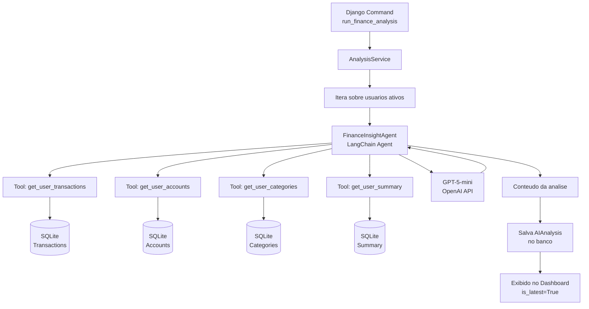

# Agente de IA Financeiro — Documentacao Tecnica

## 1. Visao geral

O **Agente de IA Financeiro** e uma funcionalidade do Finanpy que utiliza **LangChain 1.0** integrado com a **API da OpenAI** para gerar analises financeiras personalizadas para cada usuario. O agente consulta os dados do usuario (transacoes, contas e categorias) e produz insights, dicas e recomendacoes em linguagem natural, em portugues brasileiro.

---

## 2. Arquitetura



---

## 3. Fluxo completo

### 3.1 Execucao

1. O administrador executa o comando Django:
   ```bash
   python manage.py run_finance_analysis
   # ou para um usuario especifico:
   python manage.py run_finance_analysis --user-id 1
   ```

2. O `AnalysisService` consulta os usuarios ativos (ou o usuario especifico).

3. Para cada usuario:
   - O `FinanceInsightAgent` e instanciado com as tools configuradas
   - O agente consulta as transacoes, contas e categorias do usuario
   - O agente envia os dados consolidados ao LLM (GPT-5-mini)
   - O LLM retorna uma analise completa com insights e dicas
   - O resultado e salvo no model `AIAnalysis`
   - A analise anterior do mesmo usuario tem `is_latest` atualizado para `False`

4. A analise mais recente (`is_latest=True`) e exibida no dashboard.

### 3.2 Exibicao no Dashboard

- O `DashboardView` busca a analise mais recente do usuario logado
- Um card no dashboard exibe o `analysis_text` e links para insights/recomendacoes
- A pagina de detalhe (`AIAnalysisDetailView`) exibe a analise completa com `key_insights` e `recommendations`

---

## 4. Model AIAnalysis

| Campo | Tipo | Descricao |
|-------|------|-----------|
| id | BigAutoField | PK |
| user | ForeignKey(User) | on_delete=CASCADE, related_name='ai_analyses' |
| analysis_text | TextField | Conteudo completo da analise gerada |
| key_insights | JSONField | default=list, principais insights extraidos |
| recommendations | JSONField | default=list, recomendacoes geradas |
| period_analyzed | CharField | max_length=100, periodo analisado |
| model_used | CharField | max_length=50, modelo LLM utilizado (valor de settings.OPENAI_MODEL) |
| tokens_input | IntegerField | default=0, Tokens de entrada consumidos |
| tokens_output | IntegerField | default=0, Tokens de saida consumidos |
| is_latest | BooleanField | default=True, marca a analise mais recente |
| created_at | DateTimeField | auto_now_add |
| updated_at | DateTimeField | auto_now |

- `Meta.ordering = ['-created_at']`
- Indexes em `(user, -created_at)` e `(user, is_latest)`
- `__str__` retorna `f'{self.user.email} - {self.period_analyzed}'`

### Logica de `is_latest`

Ao criar uma nova analise com `is_latest=True` para um usuario:
1. Todas as analises anteriores do mesmo usuario recebem `is_latest=False`
2. A nova analise e salva com `is_latest=True`

### Rate limiting

O servico nao gera nova analise se a ultima do usuario for ha menos de 24 horas (configuravel).

---

## 5. Estrutura de arquivos

```
ai/
├── __init__.py
├── agents/
│   ├── __init__.py
│   └── finance_insight_agent.py      # Agente LangChain
├── management/
│   ├── __init__.py
│   └── commands/
│       ├── __init__.py
│       └── run_finance_analysis.py    # Django Command
├── migrations/
│   └── __init__.py
├── models.py                         # Model AIAnalysis
├── services/
│   ├── __init__.py
│   └── analysis_service.py           # Camada de servico
├── tools/
│   ├── __init__.py
│   └── database_tools.py             # LangChain tools para acesso ao banco
├── admin.py
├── apps.py
├── urls.py                           # Rotas da app ai
└── views.py                          # AIAnalysisDetailView
```

### Responsabilidades de cada modulo

| Arquivo | Responsabilidade |
|---------|-----------------|
| `models.py` | Definicao do model `AIAnalysis` |
| `agents/finance_insight_agent.py` | Configuracao do agente LangChain: LLM, prompt, execucao |
| `tools/database_tools.py` | LangChain tools para consultar transacoes, contas, categorias e resumo |
| `services/analysis_service.py` | Orquestracao: busca usuario, invoca agente, persiste resultado, rate limiting |
| `management/commands/run_finance_analysis.py` | Ponto de entrada CLI para executar a analise |
| `views.py` | AIAnalysisDetailView para exibir analise completa |
| `urls.py` | Rotas da app ai |
| `admin.py` | Registro do model no admin do Django |
| `apps.py` | Configuracao da app |

---

## 6. Dependencias

Adicionar ao `requirements.txt`:

```
langchain>=1.0.0
langchain-openai>=0.3.0
python-dotenv
```

Configuracao em `settings.py`:

```python
import os
from dotenv import load_dotenv

load_dotenv(BASE_DIR / '.env')

OPENAI_API_KEY = os.getenv('OPENAI_API_KEY', '')
OPENAI_MODEL = os.getenv('OPENAI_MODEL', 'gpt-4o-mini')
AI_MAX_TOKENS = int(os.getenv('AI_MAX_TOKENS', '2000'))
AI_TEMPERATURE = float(os.getenv('AI_TEMPERATURE', '0.7'))
```

Variaveis no `.env`:

```
OPENAI_API_KEY=sk-...
OPENAI_MODEL=gpt-4o-mini
AI_MAX_TOKENS=2000
AI_TEMPERATURE=0.7
```

Arquivo `.env.example` (referencia, **nunca** commitar a chave real):

```
SECRET_KEY=your-secret-key-here
DEBUG=True
ALLOWED_HOSTS=localhost,127.0.0.1

# OpenAI API (agente de IA financeiro)
OPENAI_API_KEY=sk-your-openai-api-key-here
OPENAI_MODEL=gpt-4o-mini
AI_MAX_TOKENS=2000
AI_TEMPERATURE=0.7
```

| Variavel | Padrao | Descricao |
|----------|--------|-----------|
| OPENAI_API_KEY | (vazio) | Chave da API OpenAI |
| OPENAI_MODEL | gpt-4o-mini | Modelo LLM utilizado |
| AI_MAX_TOKENS | 2000 | Maximo de tokens na resposta |
| AI_TEMPERATURE | 0.7 | Temperatura do modelo |

---

## 7. Execucao do Django Command

### Analise para todos os usuarios ativos

```bash
.venv\Scripts\activate
python manage.py run_finance_analysis
```

### Analise para um usuario especifico

```bash
.venv\Scripts\activate
python manage.py run_finance_analysis --user-id 1
```

### Exemplo de saida

```
Analisando usuario: joao@email.com (ID: 1)...
Analise concluida com sucesso para joao@email.com
  - Resumo: Seus gastos com alimentacao representam 35% da renda...
  - Tokens: 1200 entrada, 800 saida

Analisando usuario: maria@email.com (ID: 2)...
Analise concluida com sucesso para maria@email.com
  - Resumo: Voce esta economizando 20% da renda mensal...
  - Tokens: 980 entrada, 750 saida
```

---

## 8. Integracao com o sistema

### 8.1 Dashboard

O `DashboardView` (em `core/views.py`) sera atualizado para incluir:

```python
from ai.models import AIAnalysis

# No get_context_data:
latest_analysis = AIAnalysis.objects.filter(
    user=self.request.user, is_latest=True
).first()
context['latest_analysis'] = latest_analysis
```

### 8.2 URL de detalhe da analise

```python
# ai/urls.py
app_name = 'ai'
urlpatterns = [
    path('analise/<int:pk>/', AIAnalysisDetailView.as_view(), name='analysis_detail'),
]
```

### 8.3 Template

O card de analise no dashboard exibira:
- Resumo (`summary`) da analise
- Data da analise (`created_at`)
- Botao "Ver analise completa" linkando para `ai:analysis_detail`

---

## 9. Manutencao e expansao futura

### Proximos passos planejados

| Fase | Funcionalidade | Descricao |
|------|---------------|-----------|
| Fase 2 | Agendamento automatico | Usar Celery ou cron para executar analises periodicamente |
| Fase 3 | Endpoint HTTP | Criar view para disparar analise via requisicao POST |
| Fase 4 | Multiplos tipos de analise | Adicionar `analysis_type` como health_check, budget_review, etc. |
| Fase 5 | Historico e comparacao | Permitir comparacao entre analises de periodos diferentes |
| Fase 6 | Notificacoes | Notificar usuario quando nova analise estiver disponivel |
| Fase 7 | Testes | Testes unitarios e de integracao para o agente e servico |

### Adicionando novas tools

Para adicionar uma nova tool ao agente:

1. Criar a funcao da tool em `ai/agents/finance_insight_agent.py`
2. Decorar com `@tool` do LangChain
3. Adicionar a tool na lista de tools do agente
4. Atualizar o prompt do agente para incluir a nova capacidade

### Troca de modelo LLM

O agente e configurado via `ChatOpenAI(model=settings.OPENAI_MODEL)`. O modelo padrao e `gpt-4o-mini`, definido na variavel `OPENAI_MODEL` do `.env`. Para trocar o modelo:

1. Alterar a variavel `OPENAI_MODEL` no arquivo `.env`
2. O `settings.py` le automaticamente: `OPENAI_MODEL = os.getenv('OPENAI_MODEL', 'gpt-4o-mini')`
3. O agente usa `settings.OPENAI_MODEL` — sem hardcoded values
4. Atualizar `model_used` no `AIAnalysis` para refletir o modelo utilizado

---

## 10. Consideracoes de seguranca

- As variaveis `OPENAI_API_KEY`, `OPENAI_MODEL`, `AI_MAX_TOKENS` e `AI_TEMPERATURE` ficam no arquivo `.env` (nunca commitado)
- O arquivo `.env.example` serve como referencia e **nao** contem chaves reais
- Todas as tools filtram dados por `user_id` — isolamento completo de dados entre usuarios
- O servico implementa rate limiting (1 analise por usuario a cada 24h)
- Os dados do usuario sao enviados a API da OpenAI apenas no contexto da analise
- Cada analise e isolada por usuario — nao ha compartilhamento de dados entre usuarios
- O comando so e executado manualmente pelo administrador do sistema
- Logs nao expõem dados financeiros sensiveis
- Prompts nao vazam dados de outros usuarios